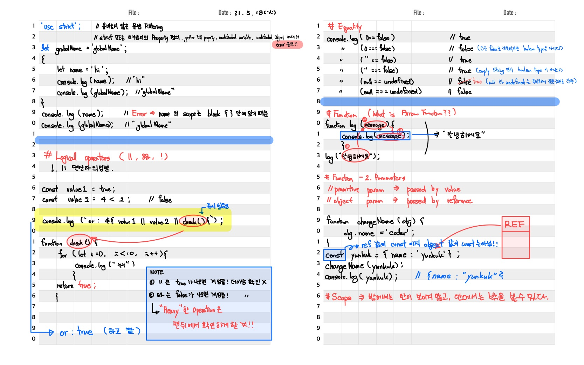
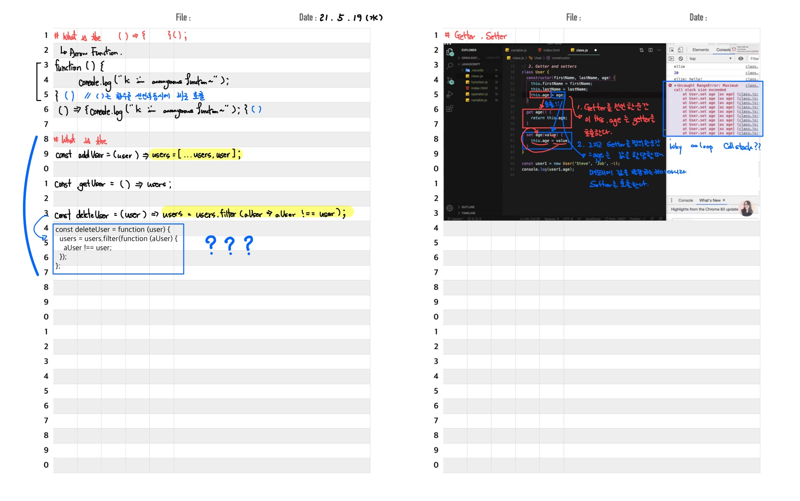
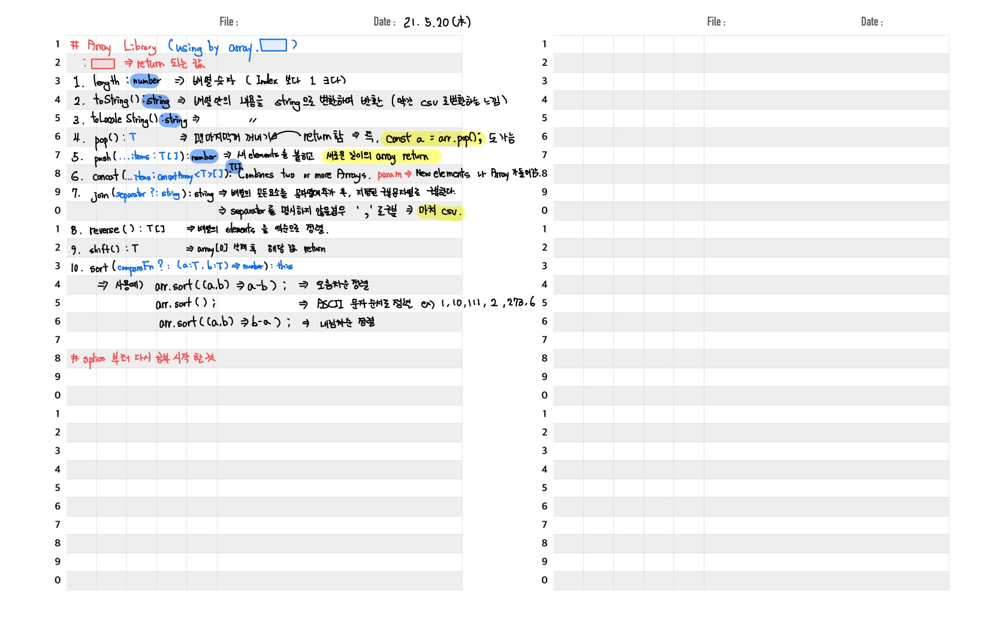

# js-learn

> Who are you? Javascript

동적인 WebSite 를 만들기 위해 Scripting 언어를 추가

하지만, 너무 많은 Browser ⇒ 표준화 X

2008년 Chrome 이 나오면서, **ECMAScript 표준안(ES5+)** 개정

> To-be

SPA ⇒ Single Page Application

FrontEnd : 쉽게 구현하기 위해 React, Angular, Vue 등 Framework 가 등장

BackEnd : node.js , react native ⇒ Mobile, electron ⇒ PC application

> Learn Javascript

### 공식사이트

[MDN Web Docs](https://developer.mozilla.org/ko/)

[Home - Ecma International](https://www.ecma-international.org/)

### Leran JavaScript

[기초 (Hello world ~ if , for)](https://www.notion.so/Hello-world-if-for-74222b22e3c54d9a9a8e0b68012564d7)

## TIL

# 21. 5 월 3주차

# 5월 17일

### 1. 모르는 점 :

Javascript ES6 문법
arrow function

Javascript ES6 문법 에 대해 공부가 더 필요하다고 느낀다.

특히 Javascript 의 object, array, class 에 대한 개념이 부족하다.

### 2. 배운 점 :

AirPod Pro 웹 사이트를 Clone 코딩을 하면서, offsetY 에 대한 control 방법에 대해서 배웠다.

아직까지는 layout setting 까지만 진행 하였다.

```jsx
(() => {
  const sceneInfo = [
    // 각 scene 에 대한 정보를 배열로 담는다.
    {
      type: 'sticky',
      heightNum: 5,
      scrollHeight: 0,
      objs: {
        container: document.querySelector('#scroll-section-0'),
      },
    },
    // ......  총 4개 Scene 을 선언 하였으니 4개 선언
  ];

  function setLayout() {
    // 각 스크롤 섹션의 높이 셋팅
    for (let i = 0; i < sceneInfo.length; i++) {
      sceneInfo[i].scrollHeight = sceneInfo[i].heightNum * window.innerHeight;
      sceneInfo[
        i
      ].objs.container.style.height = `${sceneInfo[i].scrollHeight}px`;
    }
  }

  window.addEventListener('resize', setLayout);
  // window 가 resize 되었을 때 setLayout 함수 실행
  // 평소에는 대기중
  // 근데 여기서는 왜 **setLayout()** 을 쓰지 않는가?

  setLayout(); // Layout function 실행
})();
```

### 3. 개선할 점 :

ES6 문법에 대한 공부 필요!!

# 5월 19일

### 1. 모르는 점 :

Javascript 에서 **"this"** 는 진짜 모르겠다..

왜 this 를 쓸까..

그리고 this 는 왜 계속해서 바뀔까..

getter setter 에서의 this 는 왜 쓸까??

**⇒ this 에 대해 정리를 잘 해놓은 기술블로그**

[this??](https://kkan0615.github.io/youngjin.github.io/javascript_this/)

### 2. 배운 점 :

어제부터 Javascript 의 기초 강의 (ES6 +) 에 대한 것을 공부하고 있다..

if, for loop 까지는 별 문제 없었는데,

Arrow Function 부터 막히기 시작한다..

그리고 그다음 getter setter 에서부터 사용되는 this 를 진!짜! 모르겠다.

### 3. 개선할 점 :

javascript 코드가 읽히는 과정에 대해서 조금 더 생각하면서 코드 짜기!




# 5월 20일

### 1. 모르는 점 :

함수에 함수를 부르고 뭔가를 계속 연속적으로 호출하는 것을 잘 못하겠다.

> 예를 들어, `const deleteUser = (user) => users = users.filter(aUser => aUser !== user)` 이런..

### 2. 배운 점 :

this 에 대한 감이 아주 조금 잡혔다.

Array Interface 를 공부하고 있다.  
다른 function 이나 this 등등 모르는게 있으면 **⌘ + Click** 을 하면 문서를 볼 수 있더라

코드를 치는 것도 좋지만 이론 공부 할 때는 손코딩이 더 좋은 것 같다.

### 3. 개선할 점 :

공부하다가 모를 때에는 googling 전에 공식 문서 확인 할 것


